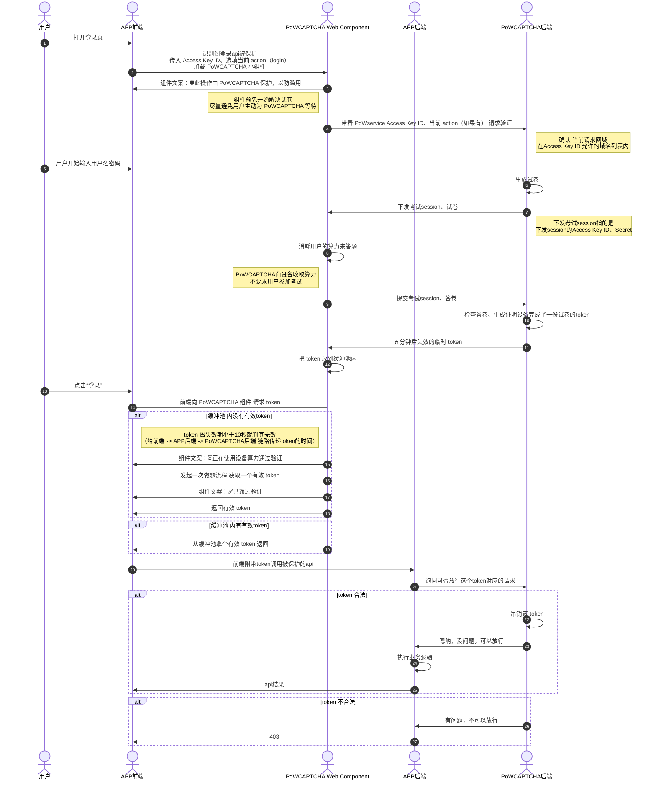

# PoWCAPTCHA

PoWCAPTCHA 是一款 使用 PoW 方案，通过要求用户设备支付一些它的算力，起到防御 特别暴力的DoS攻击 的效果的开源、开放的验证码模块。

PoWCAPTCHA 受到 [Anubis](https://github.com/TecharoHQ/anubis) 的 [启发](http://anubis.techaro.lol/docs/design/why-proof-of-work/)。

区别是，Anubis 是部署在web app前的、开箱即用的防火墙，本项目需要你改动已有项目，主动调用 PoWCAPTCHA 方可发挥作用。

### 原理

> **工作量证明（Proof-of-Work，PoW）** 是一种对应服务与资源滥用、或是拒绝服务攻击的经济对策。一般要求用户进行一些耗时适当的复杂运算，并且答案能被服务方快速验算，以此耗用的时间、设备与能源做为担保成本，以确保服务与资源是被真正的需求所使用。    

> 工作量证明系统的核心特性在于其非对称性：证明者需 **完成适度困难（但可行）** 的计算工作，而验证者能**极高效地**验证结果。——— [维基百科](https://zh.wikipedia.org/wiki/%E5%B7%A5%E4%BD%9C%E9%87%8F%E8%AD%89%E6%98%8E)

你可以使用本项目：

- 保护网站的登录服务。让DoS攻击者几乎不可能暴力破解某个用户的密码。
- 保护UGC网站的评论服务。使DoS攻击者制造垃圾内容的速度不至于那么离谱。
- ...

## 快速上手

> 为方便大家理解，把 Challenge 比作了试卷、Solution 比作了答卷

以下提供两种方法让你的项目集成 PoWCAPTCHA，选择最合适的那个。

### Rust tokio 后端：直接使用 pow-captcha Crate

若你就是用 Rust tokio / 基于tokio的框架 写的后端，那你可以直接把 PoWCAPTCHA后端 集成到你的网站后端里面去。

引用 [Crates/pow-captcha](https://crates.io/crates/pow-captcha) 到你的项目。

pow-captcha Crate 提供以下函数：

- 生成试卷
- 检查答卷是否正确
- 

### 其他后端：通过 RPC 使用 PoWCAPTCHA
你也可以单独运行本项目，后端和

## RoadMap

- 探索使用 RandomX 算法 代替 SHA加密哈希函数 以取得更强抗ASIC特性的可能性

